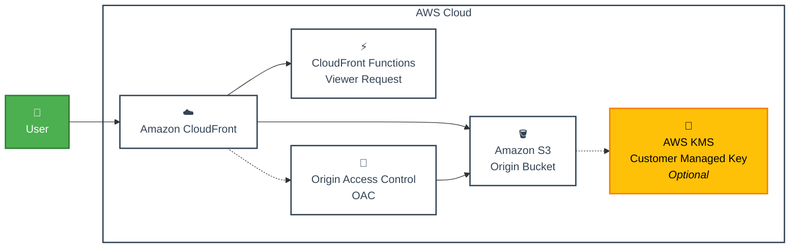

# cloudfront-cdn-template

## Architecture



## Features

- **CloudFront CDN**: エッジキャッシュによるグローバルなコンテンツ配信
- **S3静的ホスティング**: Origin Access Controlによるセキュアなプライベートバケット
- **CloudFront Function**: SPAルーティング用の自動index.html転送機能
- **KMS暗号化**: S3オブジェクトのオプションサーバーサイド暗号化
- **セキュリティ**: CloudFrontからのみアクセス可能なプライベートS3バケット

## deploy

```sh
pnpm install && \
npx -y aws-cdk@latest deploy
```
